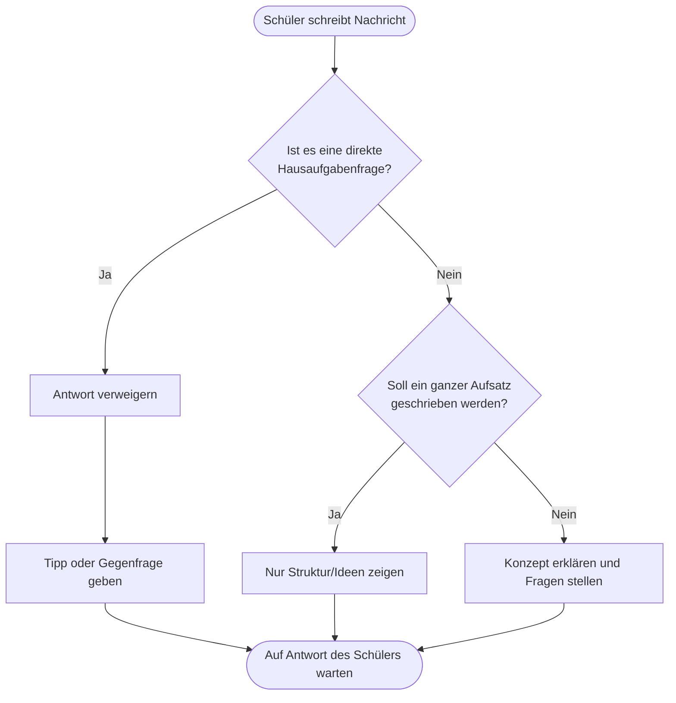

# SchoolAI – Mein lokaler KI-Tutor fürs Klassenzimmer

**Abschlussprojekt im Fach Informatik / Sozialprojekt**

- **Name:** Olivier Nerko
- **Projekt:** SchoolAI (Ein Chatbot, der beim Lernen hilft)
- **Klasse / Schule:** Sekundarstufe (15 Jahre alt)

---

## 1. Meine Idee und Motivation (Einleitung)

Meine erste Idee für das Abschlussprojekt war eigentlich ein Chatbot, der Fragen über mich beantworten kann (also über meine Hobbys, meine Schule und meine Person). Meine Projekt-Aufsicht (Frau Schwab) hat mir dann aber gesagt, dass das wegen dem Datenschutz ein großes Problem ist, weil meine privaten Daten geschützt sein müssen.

Das hat mich aber erst recht motiviert! Weil wir in der Schule ChatGPT und andere Online-KIs wegen dem Datenschutz nicht benutzen dürfen, habe ich mir eine neue Idee überlegt: Einen eigenen Chatbot namens **SchoolAI**, der komplett **offline** auf einem Computer bei uns in der Schule läuft. So werden keine Schülerdaten nach Amerika oder ins Internet geschickt.

Außerdem wollte ich unbedingt einen Admin-Bereich (ein Lehrerportal) einbauen. Damit können die Lehrer sehen, was die Schüler schreiben, und den Chatbot kontrollieren. Ich habe mich während des Projekts immer voll an meinen Plan gehalten und alles geschafft.

---

## 2. Wie der Chatbot hilft (Pädagogisches Konzept)

Normale Chatbots wie ChatGPT sind in der Schule oft ein Problem, weil Schüler sich einfach die fertigen Hausaufgaben generieren lassen. Dadurch lernt man natürlich nichts.

**SchoolAI löst das durch den sokratischen Tutor-Modus („Apertus“):**

- **Keine fertigen Lösungen:** Der Bot gibt niemals die direkte Antwort auf eine Matheaufgabe oder eine fertige Lösung.
- **Gegenfragen stellen:** Er verhält sich wie ein Nachhilfelehrer und stellt Fragen, die dem Schüler helfen, den Weg zur Lösung selbst zu finden.
- **Keine fertigen Aufsätze:** Wenn man ihn bittet, einen Aufsatz zu schreiben, gibt er nur eine Gliederung oder Ideen vor. Den Text muss der Schüler selbst schreiben.

### Der Ablauf im Chatbot sieht so aus:

---

## 3. Die Technik dahinter

Damit alles offline läuft und sicher ist, habe ich den Server selbst aufgesetzt und abgesichert.

### 3.1 Das System

Die Software ist in drei einfache Stufen aufgeteilt:

1. **Coolify Dashboard:** Das ist die grafische Oberfläche auf dem Server. Hier lade ich den Code direkt von GitHub hoch und steuere die Programme.
2. **Docker:** Docker packt die Programme in sichere, getrennte „Container“, damit sie sich nicht gegenseitig stören.
3. **SchoolAI Programme:** Das sind Next.js (die Webseite), PostgreSQL (die Datenbank) und Ollama (die künstliche Intelligenz).

### 3.2 Sicherheit (Lockdown)

Damit niemand die Datenbank oder die KI von außen hacken kann, habe ich alle Zugänge gesperrt. Sie laufen nur intern auf der Adresse `127.0.0.1` (Localhost) und sind nicht im normalen Internet sichtbar. Schüler kommen nur über die offizielle Web-Oberfläche rein.

---

## 4. Software und Datenbank

- **Webseite (Frontend):** Programmiert mit **Next.js 15** und **React**. Für das Design habe ich **Tailwind CSS** benutzt und ein cooles „Glassmorphism“-Design gebaut (dunkler Hintergrund mit lila und blauen Leuchteffekten).
- **Datenbank:** Eine **PostgreSQL** Datenbank. Über **Prisma** (ein Tool für Datenbanken) speichere ich die Benutzerkonten der Schüler, die Chatverläufe und die Einstellungen der Lehrer.
- **KI-Modell:** **Ollama** läuft lokal auf meiner Grafikkarte. Das Modell heißt **Apertus-Tutor** (basiert auf Llama 3) und ist so eingestellt, dass es sehr schlau und ruhig antwortet (Temperatur `0.3`).

---

## 5. Das Lehrerportal

Für die Lehrer gibt es oben auf der Webseite eine gelbe Leiste. Dort gibt man eine PIN ein (standardmäßig `4545`), damit Schüler im Klassenzimmer nicht einfach die Einstellungen ändern können.

**Im Lehrerportal kann die Lehrkraft:**

1. **Chats mitlesen (Audit):** Alle geschriebenen Unterhaltungen ansehen, um zu kontrollieren, ob Schüler die KI richtig nutzen.
2. **Regeln einstellen:** Per Knopfdruck festlegen, ob der Bot Aufsätze blockieren, fertige Hausaufgaben verbieten oder stur nur mit Gegenfragen (Sokratisch) antworten soll. Die Einstellungen werden sofort aktiv!

---

## 6. Mein Arbeitsprotokoll

Hier ist die vollständige und lückenlose Tabelle von allen meinen Arbeitsschritten – von der allerersten Idee im Januar bis zur finalen Fertigstellung im Mai 2026:

| Datum          | Was habe ich gemacht?                                                                                                                                                                                                                                                           | Dauer                                      | Was habe ich gelernt? (Reflexion)                                                                                                                                                                                                                                    |
| :------------- | :------------------------------------------------------------------------------------------------------------------------------------------------------------------------------------------------------------------------------------------------------------------------------ | :----------------------------------------- | :------------------------------------------------------------------------------------------------------------------------------------------------------------------------------------------------------------------------------------------------------------------- |
| **09.01.2026** | Ich habe mir heute eine Idee für das Sozialprojekt ausgedacht (in der Schule bei Herr Kamm). Zuerst alleine, am Schluss in der Gruppe. Ich hatte zwei Ideen: Erstens ein Interview mit dem Erfinder von ChatGPT oder zweitens (realistischer) einen eigenen ChatGPT-Klon bauen. | 3 Lektionen (davon 2 Lektionen Einführung) | Ich habe zwei gute Ideen gehabt. Ich bin voll motiviert, weil ich zwei sehr gute Richtungen gefunden habe.                                                                                                                                                           |
| **13.01.2026** | Heute habe ich einen neuen Branch auf GitHub erstellt. Ich habe auch angefangen, alles zu planen (Codebase Strategy etc.).                                                                                                                                                      | 2 Stunden                                  | Es gab super viel zum Lesen (ich habe eigentlich 90 Prozent nur gelesen). So sieht das Projekt aus: Erst erfährt man alles, was man machen wird, lernt darüber, und nachher macht man es. Ich bin zwar nicht der größte Leser, aber irgendwie habe ich es geschafft. |
| **16.01.2026** | Ich habe heute die Planung für die Idee "Chatbot über mich" fertiggestellt, damit ich das Frau Schwab vorstellen kann.                                                                                                                                                          | Ungefähr 2 Stunden                         | Ich hätte die Idee zuerst Frau Schwab zeigen sollen, bevor ich stundenlang plane. Sonst verliere ich unnötige Zeit, falls sie Nein sagt.                                                                                                                             |
| **23.01.2026** | Gespräch mit Frau Schwab. Wir haben besprochen, dass die Idee mit dem "Chatbot über mich" wegen dem Datenschutz nicht sicher ist. Deshalb musste ich eine neue Idee finden.                                                                                                     | 30 Minuten                                 | Es war gut, dass Frau Schwab sich erkundigt hat. Ich habe bemerkt, dass es datenschutzrechtlich echt ein Problem ist, wenn ich es über meine eigenen Daten mache.                                                                                                    |
| **26.01.2026** | Frau Schwab hat heute die neue Idee für das Projekt "SchoolAI" akzeptiert. Ich freue mich mega, weil das ein Projekt ist, das ich unbedingt machen will!                                                                                                                        | 20 Minuten                                 | Große Vorfreude und Motivation auf das genehmigte Projekt!                                                                                                                                                                                                           |
| **30.01.2026** | Ich habe meinen PC auseinandergebaut und eine neue SSD-Festplatte installiert. Außerdem habe ich Ubuntu Server auf der zweiten SSD installiert, damit ich Windows und Ubuntu getrennt auf zwei Festplatten habe.                                                                | 4 Stunden                                  | Zum Glück habe ich keine Fehler gemacht, sonst wäre das ganze System kaputtgegangen. Ich hatte erst Probleme beim Einbauen der SSD, aber nach einem YouTube-Tutorial hat es gleich geklappt.                                                                         |
| **06.02.2026** | Ich habe Linux bzw. Ubuntu genutzt. Es gab aber ein Problem: Als ich die Grafikkartentreiber wechselte, ist das Internet abgestürzt. Nach einem System-Neustart ging es zum Glück wieder.                                                                                       | 2 Stunden                                  | Es hat mich extrem aufgeregt, dass es erst nicht ging. Deswegen konnte ich an dem Tag nach dem Fixen nicht mehr viel weiterarbeiten.                                                                                                                                 |
| **21.02.2026** | Ich war in Hamburg bei einem Squash-Turnier und konnte nicht an meinem PC arbeiten. Also habe ich auf meinem Laptop Antigravity installiert, damit ich meinen PC auch von der Ferne aus steuern kann.                                                                           | 2 Stunden                                  | Ich bin ein bisschen zu schnell an die Sache herangegangen und habe zu viele Sachen auf einmal installiert. Musste danach vieles wieder löschen – da habe ich wohl eine Stunde umsonst gearbeitet.                                                                   |
| **13.03.2026** | **Phase 2 Abschluss (Architekturplanung):** Ich habe die Dokumente wie PRD, GitOps-Strategy und das System-Design aufgeschrieben, um die Systeme zu strukturieren.                                                                                                              | Ungefähr 3 Stunden                         | Saubere Theorie ist wichtig. Es war anstrengend, die Diagramme aufzusetzen, aber dadurch wussten wir genau, welche Datenbanken (PostgreSQL) und Server (Next.js) wir bauen müssen.                                                                                   |
| **20.03.2026** | **Server & GitOps Deployment:** Ich habe den Code in `main` und `dev` Branches aufgeteilt, Coolify auf meinem Ubuntu Server installiert und GitHub verknüpft.                                                                                                                   | 3 Stunden                                  | Es war richtig cool, das Server-Dashboard das erste Mal laufen zu sehen. Wir hatten erst ein Firewall-Problem (Ports waren zu), aber das haben wir im Terminal gelöst.                                                                                               |
| **27.03.2026** | **Frontend Codebase initialisiert:** Ich habe das Next.js 15 Monorepo aufgesetzt und Qualitäts-Checks wie Prettier, ESLint und Husky eingerichtet.                                                                                                                              | 4 Stunden                                  | Richtig viel geschafft an einem Tag! Dass Husky unsere Codes vor jedem Git-Commit automatisch überprüft und formatiert, spart uns später super viel Chaos.                                                                                                           |
| **04.04.2026** | **Containerization & AI Engine:** Ich habe die NVIDIA-Treiber installiert, den Server neu gestartet und Ollama (mit GPU-Zugriff) und Open WebUI zum Laufen gebracht.                                                                                                            | 2 Stunden                                  | Richtig spannend zu sehen, wie die tiefe Linux-Ebene mit Docker kommuniziert. Ein kleiner Port-Konflikt (8080) wurde schnell behoben. Wir haben jetzt unsere eigene, private KI!                                                                                     |
| **10.04.2026** | **Phase 3 Übergang (Softwareplanung):** Start der Frontend-Entwicklung. Ich habe den genauen Plan entworfen, wie wir Next.js und PostgreSQL (über Prisma) verbinden.                                                                                                            | 1 Stunde                                   | Bevor man wild drauf losprogrammiert, ist das Definieren von klaren Datenbank-Modellen (z.B. User, ChatLogs) absolut notwendig, um späteres Chaos zu vermeiden.                                                                                                      |
| **12.04.2026** | **Technische Dokumentation:** Ich habe die Dokumentation geschrieben (`Phase-3-Technical-Manual.md`) und das Agenten-Konzept (`AGENTS.md`) eingerichtet, um die KI-Steuerung zu sichern.                                                                                        | 3 Stunden                                  | Die Pläne zentral zu speichern, spart extrem viel Zeit. So wissen die KI und ich immer genau, welches Design und welche Regeln für welche Aufgabe gelten.                                                                                                            |
| **03.05.2026** | **Datenbank-Sync & UI-Design:** Ich habe das Prisma-Schema aktualisiert und die Web-Oberfläche mit dem schicken Glassmorphismus-Design programmiert.                                                                                                                            | 4 Stunden                                  | Komplexe UI-Designs mit Next.js sind echt schwer zu coden, aber das Endergebnis sieht richtig modern und professionell aus.                                                                                                                                          |
| **08.05.2026** | **Session-Management & Übersetzungen:** Ich habe dafür gesorgt, dass man mehrere Chats erstellen kann, und die gesamte App auf Deutsch und Englisch übersetzt.                                                                                                                  | 3 Stunden                                  | Die Mehrsprachigkeit macht die App perfekt für den Einsatz im echten Unterricht.                                                                                                                                                                                     |
| **10.05.2026** | **Lehrerportal & Logins:** Ich habe das Lehrer-Dashboard gebaut und das Login-System mit sicherer Passwort-Verschlüsselung (`bcrypt`) programmiert.                                                                                                                             | 5 Stunden                                  | Sicherheit und Kontrolle für die Lehrer waren echt harte Arbeit zu programmieren, sind aber super wichtig.                                                                                                                                                           |
| **11.05.2026** | **KI-Kalibrierung & Abschluss:** Ich habe das sokratische Verhalten in Ollama eingestellt (über ein custom Modelfile) und alles auf Herz und Nieren getestet.                                                                                                                   | 3 Stunden                                  | Das Projekt ist jetzt zu 100% fertig für die Präsentation morgen.                                                                                                                                                                                                    |

---

## 7. Mein Fazit und Ausblick

### 7.1 Was ich gelernt habe

Das Projekt war eine riesige Erfahrung für mich. Ich habe gelernt, wie man einen echten Server einrichtet, Hardware einbaut (meine neue SSD) und echte Webseiten programmiert.
Besonders stolz bin ich darauf, wie ich die künstliche Intelligenz (Ollama) so einstellen konnte, dass sie nicht einfach vorsagt, sondern Schülern wirklich hilft.
Ich weiß jetzt viel besser, wie Linux funktioniert und wie man Datenbanken nutzt.

### 7.2 Was als Nächstes kommt (Juni 2026)

Die App läuft stabil und ist komplett fertig. Im Juni wollen wir:

1. **Offline testen:** Wir wollen testen, ob Schüler mit ihren eigenen Laptops im Schulnetzwerk ohne normales Internet mit dem Bot chatten können.
2. **Feedback sammeln:** Ein paar Mitschüler werden die App testen und mir sagen, ob der Tutor schlau antwortet und schnell genug ist.

SchoolAI zeigt, dass man KIs in der Schule sicher und ohne Angst vor Datenschutzproblemen einsetzen kann, um wirklich etwas zu lernen!
