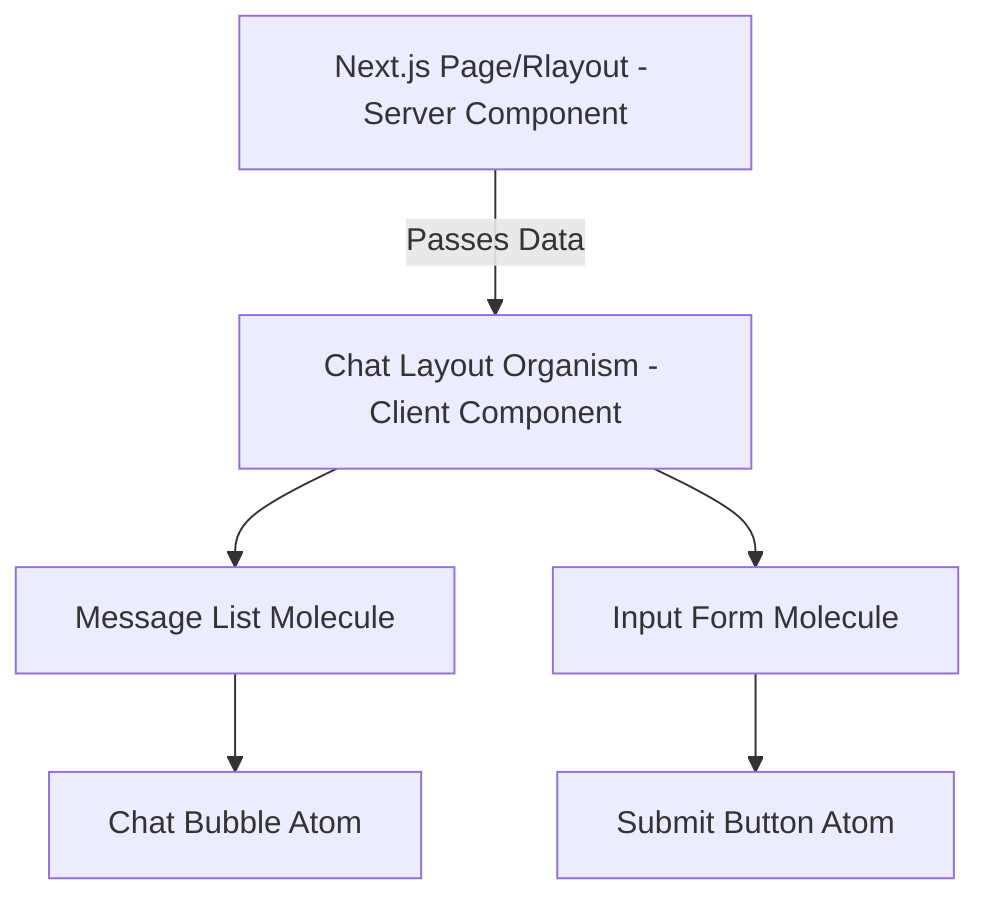
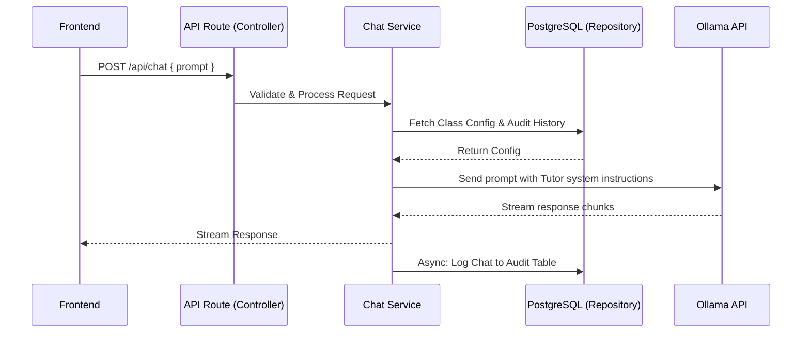

# Codebase Strategy & Scalable Components

## 1. Monorepo Architecture
SchoolAI will utilize a **Monorepo** structure. This ensures that any changes to the backend API contracts or the AI modelfiles are instantly validated against the frontend code, providing a single source of truth.

```text
school-ai-server/
├── apps/
│   ├── web/                # Next.js Frontend & API Routes
│   └── ai-engine/          # Ollama modelfiles and custom python scripts
├── packages/
│   ├── ui/                 # Shared React components (shadcn/ui)
│   ├── database/           # Prisma schema and generated client
│   └── typescript-config/  # Shared tsconfig.json
└── docs/                   # Architecture and planning documentation
```

## 2. Scalable Frontend Components
The frontend will be built using **Next.js 15 (App Router)** to maximize performance and SEO, employing the following scalable patterns:

*   **React Server Components (RSC)**: Used by default for data fetching and layout rendering. This reduces the JavaScript bundle size sent to the client.
*   **Atomic Design Pattern**: UI components will be isolated in the `packages/ui` folder, separated into "Atoms" (buttons, inputs), "Molecules" (form fields combination), and "Organisms" (full chat interface).
*   **State Management**: 
    *   *Server State*: Managed via React Query (or Next.js native fetching/caching mechanisms) for fetching class lists and audit logs.
    *   *Client State*: Managed via Zustand for lightweight, scalable UI state (e.g., sidebar toggles, active chat session).

### Frontend Component Flow


## 3. Scalable Backend Services
While initially housed within Next.js API Routes, the backend logic represents a modular service architecture that can be scaled or separated into a standalone Node.js microservice if the load requires it.

*   **Controller Layer**: Handles HTTP requests, input validation (using Zod), and response formatting.
*   **Service Layer**: Contains the core business logic (e.g., verifying if a user has access to a specific class, or applying Tutor Mode rules).
*   **Repository / Data Layer**: Interacts with the PostgreSQL database using an ORM like Prisma.

### Backend Data Flow


## 4. Quality Control & Standards
- **Branching**: Trunk-based development (`dev` -> `main`). 
- **Linting**: Enforced strictly via Prettier and ESLint (pre-commit hooks powered by Husky/Lint-Staged).
- **Type Safety**: End-to-end TypeScript. The API responses are strictly typed and shared with the frontend to catch contract breaking changes at compile time.
