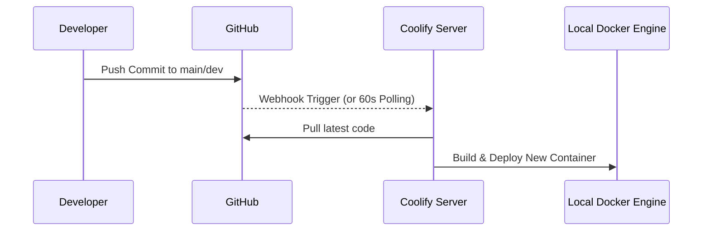
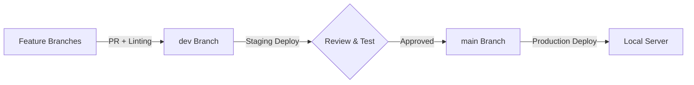

# GitOps & Codebase Strategy

## GitOps Infrastructure
To maintain a strict, reliable deployment pipeline for SchoolAI, we are implementing a robust GitOps methodology.

- **Deployment Model**: **Pull-based GitOps via Coolify**. Coolify acts as our deployment manager on the server. It actively watches the GitHub repository and pulls changes when Webhooks trigger. This prevents us from having to open inbound SSH ports on the local school network just for deployments.
- **Reconciliation Loop**: 60 seconds interval to check for state drift in the Docker manager.
- **Secret Management**: Environment variables injected securely at the deployment level via the Coolify dashboard, keeping them completely out of the Git repository.
- **CI/CD Pipeline**: 
  - *Test*: GitHub Actions runs code linting (Prettier/ESLint) on PRs to `dev`.
  - *Deploy*: Webhooks trigger automated rebuilds and zero-downtime re-deployments upon any push to `dev` (Staging) or `main` (Production).

### GitOps Pipeline Flow

## Codebase Strategy
- **Structure**: **Monorepo**. The entire ecosystem (Next.js portals, Ollama Modelfiles, scripts) lives in a single repository. This ensures breaking changes in the AI models are instantly caught by the frontend configuration.
- **Branching Model**: **Trunk-based development**.
    - `dev` Branch: Active development and staging. Short-lived feature branches merge here quickly to avoid merge conflicts.
    - `main` Branch: Production source of truth.
- **Quality Control**:
  - **Linting**: Enforced strictly via Prettier and ESLint in pre-commit hooks.
  - **Branch Protection**: `main` requires at least 1 approving review and passing CI status checks to merge.

### Branching Flow

