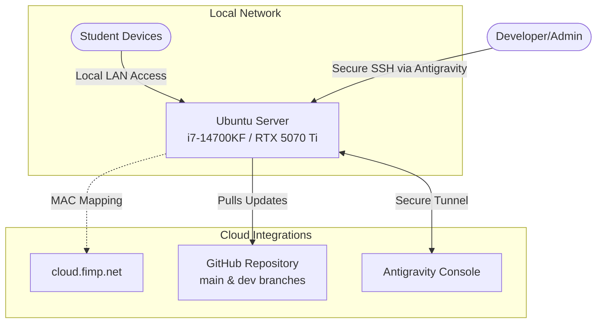

# Phase 2: Hardware & Network Topology

## Physical Infrastructure
The SchoolAI platform runs exclusively on dedicated, locally-hosted hardware to guarantee zero external data leakage and robust performance without internet dependencies.

### Server Specifications
- **Machine**: Captiva PC
- **CPU**: Intel Core i7-14700KF
- **GPU**: NVIDIA GeForce RTX 5070 Ti (Used exclusively for accelerated LLM inference)
- **Primary Drive (OS A)**: 1TB NVMe (Windows - Inactive for SchoolAI)
- **Secondary Drive (OS B)**: 2TB NVMe (Ubuntu Server - Active Host)

## Network Topology & Access
The server resides on a local network but requires specific tunnels for secure administration and CI/CD pipelines.

## Identity and Access Details
1. **Network Identity**: Static identity configured via Netplan, mapping the hardware MAC address to `cloud.fimp.net`.
2. **Google Antigravity Agent**: Installed directly to the host OS. This establishes an authenticated, outbound-only secure tunnel, allowing the admin to SSH into the machine remotely without opening firewall ports.
