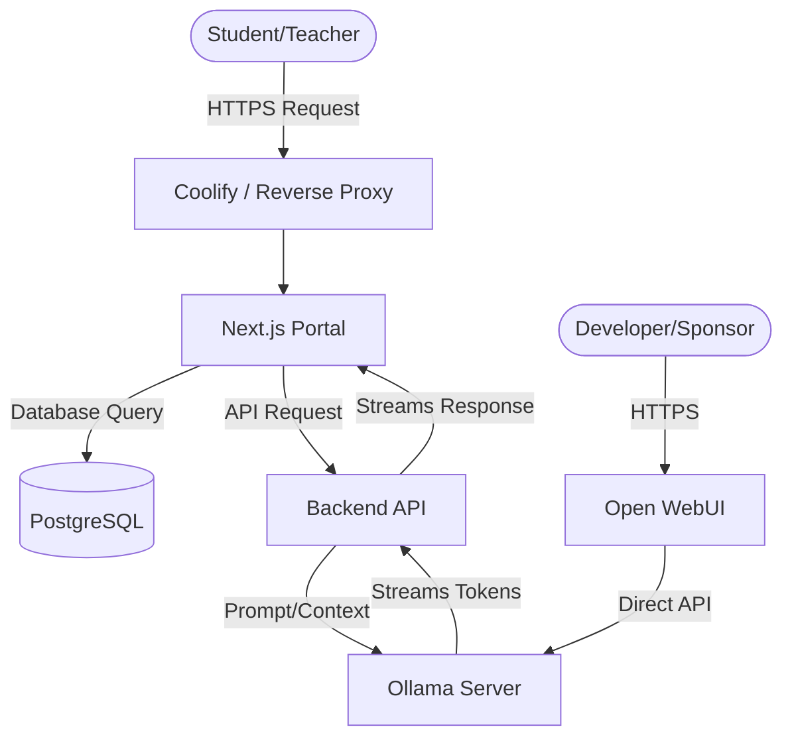

# SchoolAI System Architecture

## Core Components & Tech Stack
1. **Frontend (The Teacher/Student Portal)**: 
   - *Framework*: Next.js 15 (App Router, React 19)
   - *Styling*: Tailwind CSS + shadcn/ui
   - *Role*: Handles user authentication, class management, and the custom chat interface.
2. **Backend API**:
   - *Framework*: Next.js API Routes (Server Actions) or a dedicated Node.js/Express service.
   - *Database*: PostgreSQL (for user data, chat logs, and class configurations).
3. **AI Inference Layer**:
   - *Engine*: Ollama (GPU Accelerated via RTX 5070 Ti)
   - *Management*: Open WebUI (for admin testing and prompt engineering).

## Data Flow Diagram

## API Contracts & Communication
- The Next.js frontend will communicate with the backend via RESTful API or Server Actions.
- The Backend will communicate with Ollama using the local `http://ollama:11434/api/generate` and `/api/chat` unified endpoints.
