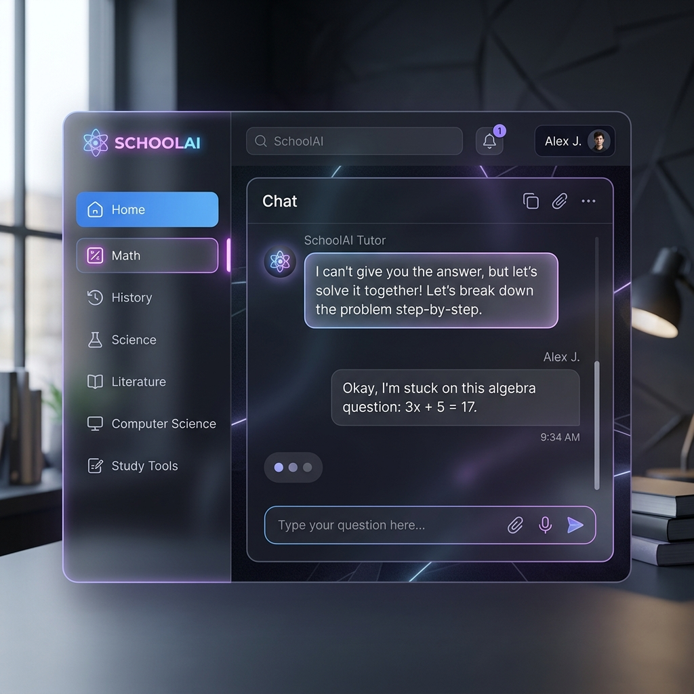
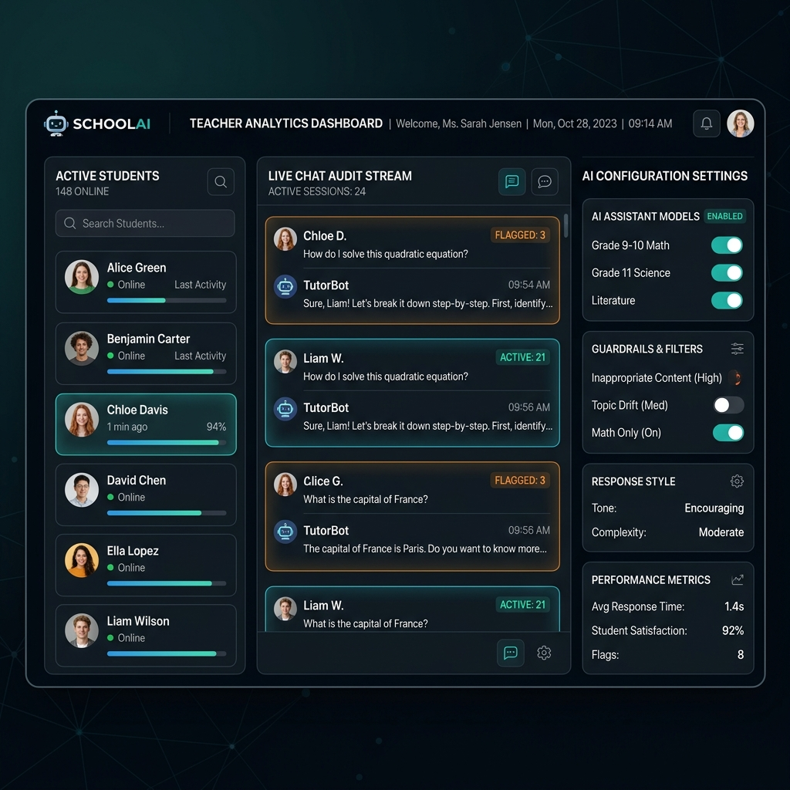

# Phase 3 Implementation Masterplan: Portal & Security

This is the official approved strategy for finalizing Phase 3. It covers infrastructure security, database logic, and the premium frontend implementation.

## 1. Security & Infrastructure Rectification [TO DO]

We must harden the current Docker setup on the Captiva PC to ensure the AI engine and Database are not exposed to the public internet.

- **Port Lockdown**: Re-bind PostgreSQL (5432) and Ollama (11434) to `127.0.0.1`.
- **Secret Management**: Abstract the `POSTGRES_PASSWORD` into Coolify's Environment Variables panel rather than hardcoding it in YAML.

## 2. Database Schema Finalization [TO DO]

We utilize Prisma ORM to map the following relational models into the `schoolaidb`:

- **`User` Table**: Role-based accounts for Students and Teachers.
- **`ChatSession` Table**: logical grouping of messages.
- **`Message` Table**: Immutable audit trail for every prompt and response.

## 3. Frontend Portal Development (Design Targets)

We are building a premium "Glassmorphism" interface based on the following high-fidelity designs:

### Student UI Goal

### Teacher UI Goal

## 4. Atomic Design Strategy

The frontend code in `apps/web` follows the Atomic Design pattern:

- **Atoms**: Fundamental pieces (Buttons, Inputs).
- **Molecules**: Combined pieces (Chat bubbles).
- **Organisms**: Full layout sections (Chat Windows).
- **Templates**: Page structures (App Layouts).
