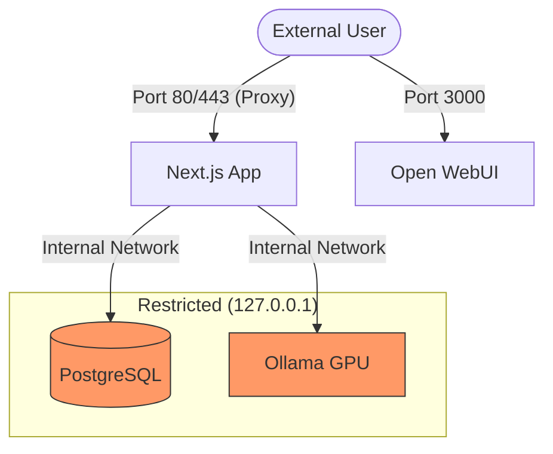
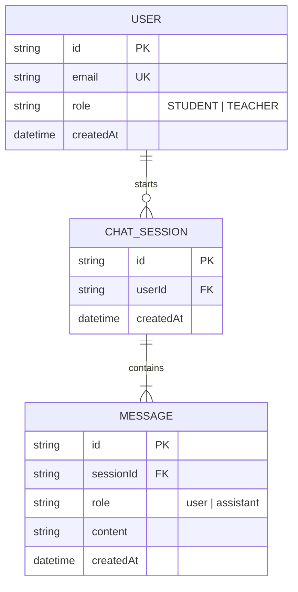
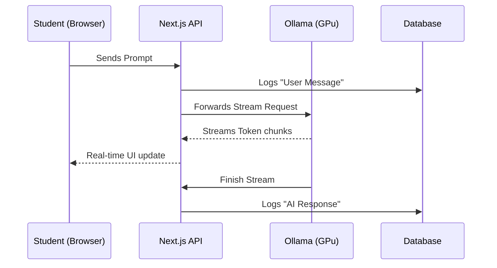

# Phase 3 technical Manual: Architecture & Maintenance

This manual serves as the primary technical reference and documentation guide for the "Project Portal" development phase. It combines detailed design specifications with maintenance plans for future stakeholders.

---

## 1. Security & Network Hardening

**Task**: Isolation of AI and Database services from the public internet.

### Design Specification (Network Isolation)

We utilize a **Local-Host-Only Binding** strategy. By default, Docker containers often expose ports to `0.0.0.0` (anyone). We will explicitly bind to `127.0.0.1`.

### Documentation & Audit Plan

- **Verification**: Run `netstat -tulpn` on the server. If `5432` or `11434` show `0.0.0.0`, the system is insecure. They MUST show `127.0.0.1`.
- **Secrets**: Database passwords must **never** be written in `.env` or YAML. They must reside in the Coolify "Environment Variables" tab.

---

## 2. Relational Database Integration

**Task**: Designing the persistent storage for school activities.

### Design Specification (ERD)

We use Prisma ORM to map the pedagogical requirements into a relational structure.

### Documentation & Migration Plan

- **Schema Updates**: Always use `npx prisma db push` during development (`dev` branch).
- **Backups**: Periodically export the `postgres_data` volume to ensure student logs are never lost.

---

## 3. Premium UI & Design System

**Task**: Building a state-of-the-art educational interface.

### Design Specification (Atomic Layout)

We use **Atomic Design** to separate concerns:

- **Atoms**: `Button.tsx`, `ChatBubble.tsx` (CSS only).
- **Molecules**: `MessageInput.tsx`, `SubjectCard.tsx` (Stateful).
- **Organisms**: `ChatWindow.tsx`, `Sidebar.tsx` (Complete features).

**Theme Tokens**:

- **Background**: `bg-zinc-950` (Deep Black).
- **Accents**: `violet-500` and `blue-500` (Neon gradients).
- **Glassmorphism**: `backdrop-blur-md bg-white/5 border-white/10`.

### Documentation Plan

- **Consistency**: All new components must be placed in `apps/web/src/components/` following the Atomic folder naming convention.

---

## 4. App Logic & Interaction Flow

**Task**: Connecting React to the AI brain.

### Design Specification (Logical Flow)

We utilize **React Server Components (RSC)** for performance and secure API handling.

### User Manual Blueprint

- **Student Guide**: Focus on "Prompting for Hints" (Socratic Method).
- **Teacher Guide**: Focus on the "Audit View" and "Class Management".
