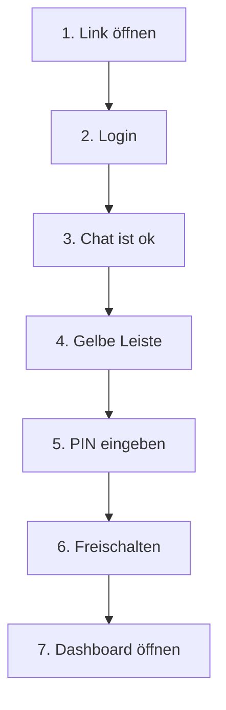

# SchoolAI — Lehrerportal (einfache Schritte)

Für **Lehrkräfte** ohne IT-Kenntnisse. Lesen Sie zuerst nur die **nummerierten Schritte**.

---

## So geht’s — Lehrerportal öffnen

1. **Browser öffnen** (Chrome, Edge, Firefox …).
2. **Schul-Link** eintragen — die Adresse, die Ihnen die **Schule oder IT** gegeben hat.
3. **Login** klicken und mit **E-Mail und Passwort** anmelden.
4. Sie sehen meist den **Chat** — **normal**, Sie sind richtig.
5. **Oben** die **gelbe Leiste** „Lehrer-Modus“ finden.
6. **PIN** eintragen und auf **Freischalten** klicken.  
   _(Pilot: oft **`4545`**, wenn die IT nichts anderes mitgeteilt hat.)_
7. **Lehrer-Dashboard öffnen** klicken — jetzt sind Sie im Lehrerportal.

**Fertig am PC?** → **Lehrer-Modus sperren** klicken (in der gelben Leiste oder im Portal). So bleibt der Lehrer-Bereich auf diesem Rechner geschlossen.

---

## Chat-Regeln ändern (wenn Sie möchten)

1. Im Lehrerportal links/menü: **Chat-Schutz** öffnen.
2. Schalter **ein** oder **aus** stellen (z. B. keine fertigen Hausaufgaben).
3. **Speichern** klicken.
4. Fertig — **neue** Tutor-Antworten folgen den Regeln.

---

## Schüler-Ansicht zeigen

1. **Schüler-Ansicht** oder **Chat** öffnen (Link im Portal oder Menü).
2. So sieht die App für **Schülerinnen und Schüler** aus.

---

## Bildschirm in einem Blick

```text
┌─────────────────────────────────────────┐
│ GELB: Lehrer-Modus + PIN + Freischalten │
├─────────────────────────────────────────┤
│              CHAT                       │
├─────────────────────────────────────────┤
│         Eingabe + Senden                │
└─────────────────────────────────────────┘
```

---

## Wozu das Portal?

- **Überblick:** Wer war im Chat?
- **Gespräch lesen:** Eine Sitzung öffnen.
- **Chat-Schutz:** Regeln für alle (siehe oben).

---

## Heute und Juni

- **Heute:** Nutzung über **Internet** (Schul-Adresse). Zuhause oder Schule möglich.
- **Juni (Plan):** Schüler bringen **eigene PCs** in die Schule und **zeigen**, dass es **ohne öffentliches Internet** (oder im Schulnetz) geht — Details sagt die **IT / Projektleitung**.

---

## Etwas klappt nicht?

| Problem           | Fragen Sie   |
| ----------------- | ------------ |
| Login / Passwort  | Schule / IT  |
| PIN               | IT           |
| Seite lädt nicht  | IT           |
| Unterricht / Fach | Koordination |

---

**Diagramm (optional):** Ablauf als Bild — z. B. auf GitHub sichtbar.



_Dokument: Lehrerportal, PIN, Chat-Schutz. „Juni“ anpassen, wenn der Offline-Umfang feststeht._
