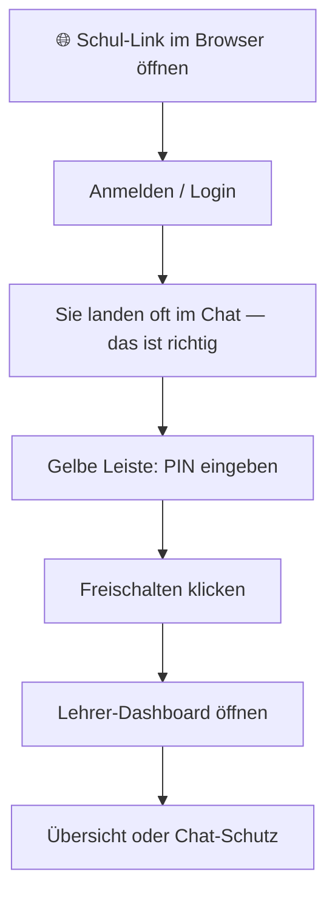
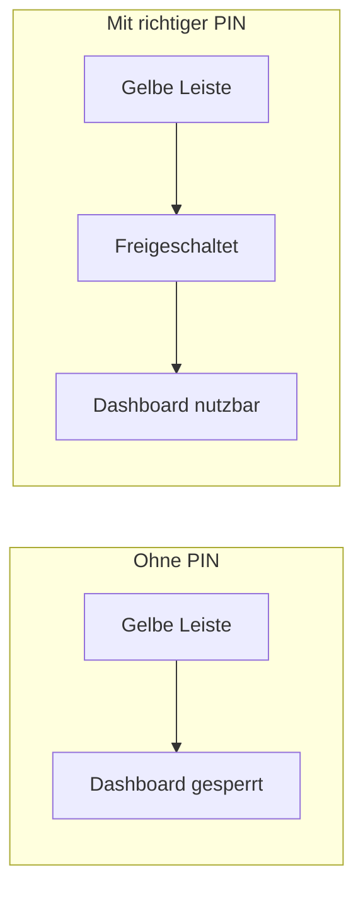
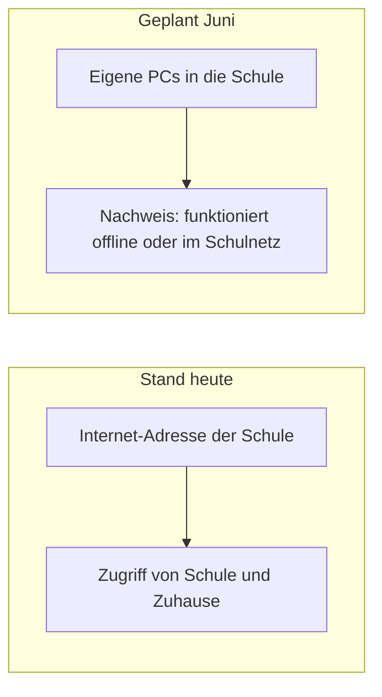

# SchoolAI — Lehrerportal (einfach erklärt)

Diese Anleitung richtet sich an **Lehrkräfte und Schulpersonal** ohne IT-Vorkenntnisse. Sie erklärt, **wo Sie klicken**, was die **gelbe Leiste** bedeutet und wofür das **Lehrerportal** da ist.

**Hinweis zu den Zeichnungen:** Die **farbig markierten Ablaufpläne** (Diagramme) werden auf GitHub und in vielen Programmen automatisch als Bild angezeigt. Öffnen Sie diese Datei dort, falls Sie nur Text sehen.

---

## 1. Was Sie auf dem Bildschirm sehen (Skizze)

Stellen Sie sich den Chat wie ein **Fenster mit drei Ebenen** vor — von oben nach unten:

```text
    ┌─────────────────────────────────────────────────────────┐
    │  GELBE LEISTE: „Lehrer-Modus“ + PIN + Freischalten      │  ← nur für Lehrkräfte
    ├─────────────────────────────────────────────────────────┤
    │                                                         │
    │              CHAT (Schüler-Ansicht)                    │  ← hier schreiben Schüler
    │                                                         │
    ├─────────────────────────────────────────────────────────┤
    │              Eingabefeld + Senden                       │
    └─────────────────────────────────────────────────────────┘
```

Die **gelbe Leiste** ist wie ein **Schloss vor dem Lehrerzimmer**: Solange es zu ist, können Sie das **Lehrer-Dashboard** nicht sinnvoll nutzen. Nach der PIN sind **Zusatzfunktionen** frei (Übersicht, Gespräche ansehen, Regeln).

---

## 2. Wofür das Lehrerportal gut ist

SchoolAI ist ein **KI-Tutor im Chat**. Er soll **Lernen unterstützen** (Fragen, Erklärungen, Üben) — nicht die Arbeit der Schülerinnen und Schüler ersetzen.

Mit dem **Lehrerportal** können Sie:

1. **Überblick** — Wer war zuletzt im Chat? Wann ungefähr?
2. **Einzelgespräch ansehen** — Wenn Sie nachfassen oder jemanden unterstützen möchten.
3. **Chat-Schutz** — Regeln für alle (z. B. keine fertigen Hausaufgaben, eher Rückfragen). Gilt für **neue** Antworten des Tutors, nachdem Sie gespeichert haben.

Das gehört zum **Schulprojekt** — bitte weiterhin mit Ihren üblichen Regeln zu Unterricht und Prävention kombinieren.

---

## 3. So kommen Sie ins Lehrerportal (Ablauf als „Wegkarte“)



**Schritt für Schritt:**

1. **Link** von der Schule oder der IT verwenden (beginnt meist mit `https://`).
2. **Login** mit dem Konto, das Ihnen **Schule oder IT** gegeben hat (E-Mail und Passwort).
3. Sie sehen oft zuerst den **Chat** — das ist beabsichtigt.
4. Oben die **gelbe Leiste** „Lehrer-Modus“: **PIN** eintragen und **Freischalten**.
5. Danach erscheint u. a. **Lehrer-Dashboard öffnen** — dort ist das Portal.

### PIN in einfachen Worten



**Pilot-Stand:** Wenn die Schule **keine eigene PIN** auf dem Server eingestellt hat, ist die **Demo-PIN** oft **`4545`**. Wenn die IT eine **eigene PIN** setzt, teilt sie Ihnen die neue mit.

**Tipp:** Wenn ein Link mit `?teacherPin=1` endet, springt die Seite direkt zur PIN — praktisch nach einer Weiterleitung.

### Wieder abschließen

Wenn Sie einen **gemeinsamen Rechner** verlassen oder eine **Präsentation** beenden: **Lehrer-Modus sperren** (im Portal oder an der Leiste). Dann ist der Lehrer-Zugang auf **diesem Browser** wieder weg, bis jemand die PIN erneut eingibt.

Die **Schülerkonten** bleiben davon getrennt — die PIN schützt nur den **Lehrer-Bereich** auf **Ihrer** Sitzung.

---

## 4. Im Dashboard: Was bedeuten die Bereiche?

### Übersicht

- **Aktive Sitzungen** — Momentaufnahme, wer im System sichtbar ist.
- **Verschiedene Schülerkonten** — grobe Zahl unterschiedlicher Nutzer in dieser Ansicht.
- Von hier aus können Sie eine **Sitzung öffnen** (Verlauf lesen) oder zu **Chat-Schutz** wechseln.

### Chat-Schutz (Einstellungen)

Hier schalten Sie Regeln **ein oder aus**. Kurz erklärt:

| Einstellung (im Programm)        | Was es für den Unterricht bedeutet                                                     |
| -------------------------------- | -------------------------------------------------------------------------------------- |
| **Keine vollen Aufsätze**        | Der Tutor soll keine fertige, lange Abgabe „in einem Stück“ schreiben.                 |
| **Keine fertigen Hausaufgaben**  | Statt kompletter Lösung: eher Tipps und Leitfragen.                                    |
| **Keine Musterklausur-Lösungen** | Keine durchgerechneten Prüfungen als Vorlage; Strategien und Selbstcheck sind möglich. |
| **Streng sokratischer Ton**      | Mehr Rückfragen und Führen, weniger „reine Endantwort“.                                |

Nach Änderungen **Speichern** klicken. **Neue** Chat-Antworten richten sich danach.

### Schüler-Ansicht

**Schüler-Ansicht** (oder Seite „Chat“) zeigt die App **wie für Schülerinnen und Schüler** — gut, um im Unterricht zu erklären.

---

## 5. Heute: Internet — Juni: Computer mit in die Schule



**Stand heute:** SchoolAI ist über das **Internet** erreichbar — mit der Adresse, die Ihre Schule oder IT mitteilt. Zuhause oder in der Schule nutzbar, sofern das Netzwerk die Seite erlaubt.

**Geplant für Juni:** Schülerinnen und Schüler bringen **eigene PCs in die Schule** und **zeigen**, dass die Lösung **ohne öffentliches Internet** (oder in einem **schulinternen** Aufbau) funktioniert — je nachdem, was das Projekt genau vorgibt.

Bis dieser Meilenstein **vollständig** umgesetzt ist, können **einzelne Funktionen** noch vom Netz oder vom Schulserver abhängen. **IT oder Projektleitung** sagt Ihnen rechtzeitig, was im Juni **garantiert offline** demonstriert werden soll.

---

## 6. Wenn etwas nicht klappt — wen fragen?

| Problem                         | Wen fragen                                        |
| ------------------------------- | ------------------------------------------------- |
| Passwort vergessen / Login      | Schulsekretariat oder IT                          |
| PIN wird nicht angenommen       | IT (PIN kann auf dem Server geändert worden sein) |
| Seite lädt nicht, Fehlermeldung | IT / Hosting                                      |
| Fachlich / Regeln im Unterricht | Fachschaftsleitung oder Koordination              |

---

_Dokument-Version: Lehrerportal mit Präsentations-PIN, Übersicht, Sitzungs-Audit und Chat-Schutz. Abschnitt „Juni“ anpassen, sobald der Offline-Umfang feststeht._
