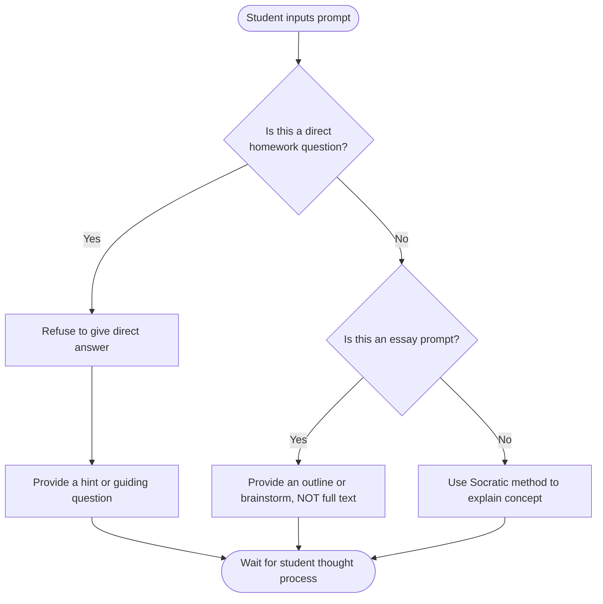

# Product Requirements Document (PRD) - Phase 1

## 1. Project Overview
SchoolAI is an offline-first, locally-hosted AI educational platform designed to provide a secure and focused learning environment. The core value proposition is "Tutor Mode"—an AI assistant configured specifically to guide students towards answers rather than completing their assignments for them.

## 2. Target Audience & Stakeholders
- **Primary Users (Students)**: Need a responsive, helpful assistant to explain complex topics, review drafts, and provide hints when stuck on homework.
- **Sponsors (Parents)**: Require assurance that the AI is not facilitating plagiarism. They need the AI to act as a strict but encouraging pedagogical tool.
- **Reporting Cadence**: Daily stand-ups and a formal weekly presentation to the Sponsors to demonstrate progress.
- **Admin/Devs**: Need a robust, GitOps-driven deployment strategy (Coolify, Docker, GitHub) to manage updates reliably.

## 3. Core Problems to Solve (Teacher Pain Points)
Based on direct teacher interviews, SchoolAI must address:
1. **Over-reliance on AI**: Students use ChatGPT too much, completely bypassing the learning process.
2. **Data Privacy**: Schools cannot mandate or verify what happens to student data on public AI platforms.
3. **Authenticity (Real vs. Fake)**: Teachers cannot distinguish between student effort and AI-generated content.

## 4. Feature Definition: Tutor Mode ("Must-Haves")
To solve the pain points above, Tutor Mode enforces strict pedagogical rules:
1. **Rule 1 (No direct answers)**: The AI must never output a direct solution to a math equation or a full paragraph of text for an essay. It only provides hints or outlines.
2. **Rule 2 (Process over Product)**: The AI must ask guiding questions to ensure the student understands the *method*, addressing the "too much ChatGPT" pain point.
3. **Rule 3 (Transparency)**: The AI's outputs must be stylized as a "Tutor" (e.g., using specific framing or formatting) to help teachers distinguish SchoolAI guidance from raw text generation.

### Tutor Mode Logic Flow

## 5. Success Metrics
- **Performance**: Time to First Token (TTFT) < 5 seconds on the local RTX 5070 Ti.
- **Safety Rate**: 0% success rate during adversarial testing ("trick the AI into writing an essay").
- **Adoption**: Successful daily stand-ups and weekly demo schedule maintained with Sponsors (Parents).
