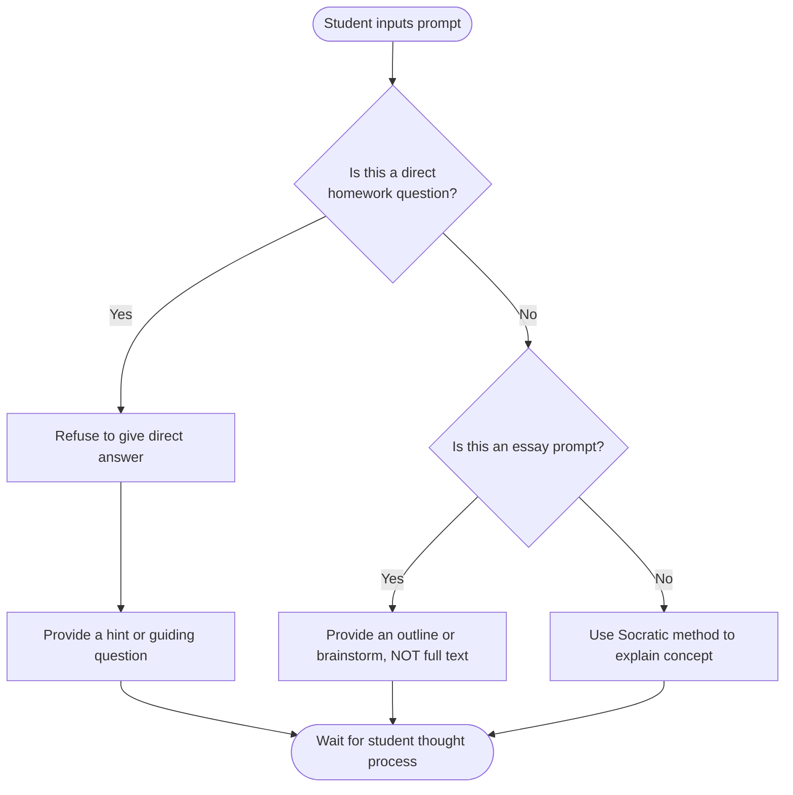

# Phase 1: Product Kickoff & Requirements

## Overview
SchoolAI is an offline-first, locally-hosted AI educational platform designed to provide a secure and focused learning environment. The core value proposition is "Tutor Mode"—an AI assistant configured specifically to guide students towards answers rather than completing their assignments for them.

## Target Audience & Reporting
- **Primary Users (Students)**: Need a responsive, helpful assistant to explain complex topics, review drafts, and provide hints when stuck on homework.
- **Sponsors (Parents)**: Require assurance that the AI is not facilitating plagiarism. They need the AI to act as a strict but encouraging pedagogical tool.
- **Reporting Cadence**: Daily stand-ups and a formal weekly presentation to the Sponsors.

## Tutor Mode Rules & Logic Flow
To solve the pain points of AI over-reliance, data privacy, and authenticity, the AI must adhere to the following logic path:

## Success Metrics
- **Performance**: Time to First Token (TTFT) < 5 seconds on the local RTX 5070 Ti.
- **Safety Rate**: 0% success rate during adversarial testing ("trick the AI into writing an essay").
- **Adoption**: Successful daily stand-ups and weekly demo schedule maintained with Sponsors.
